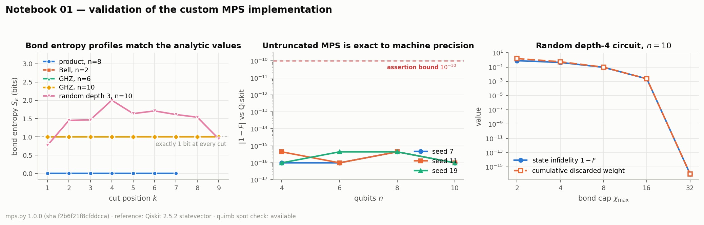
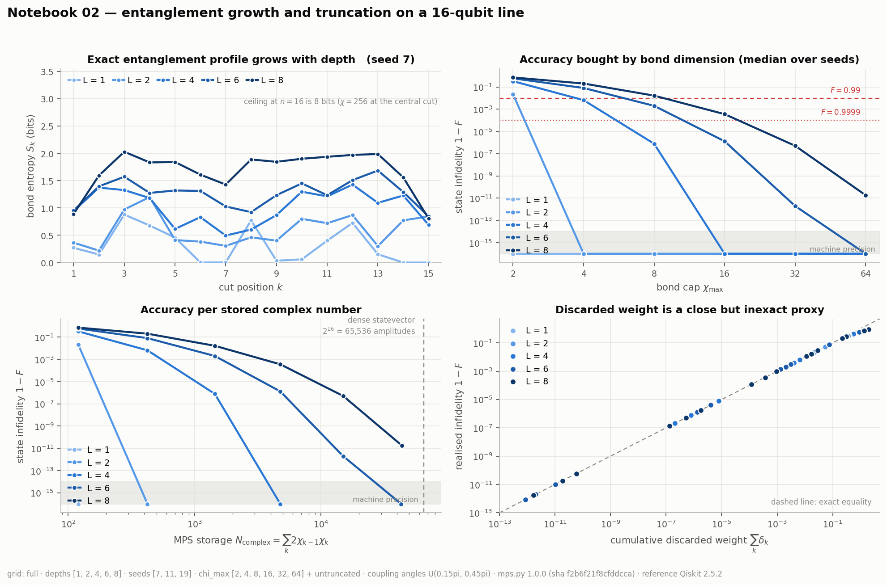
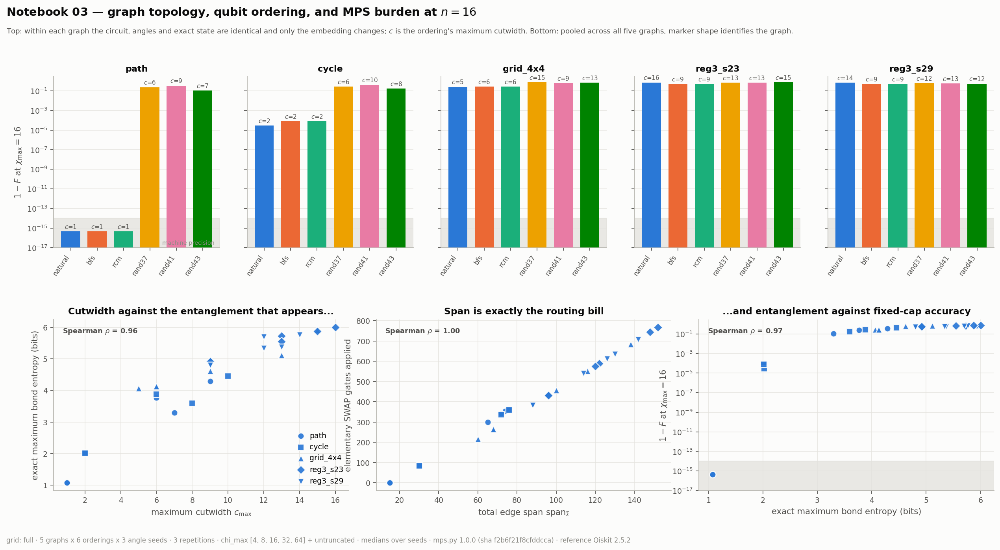
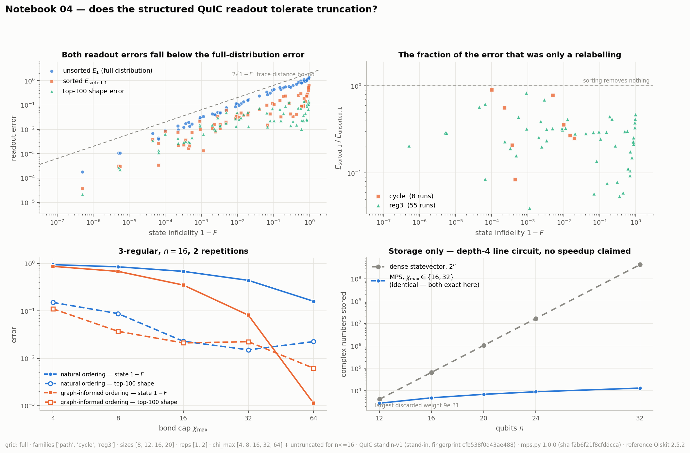

# Tensor-network simulation of graph-structured quantum circuits

A controlled study of how entanglement, graph topology, qubit ordering and matrix-product-state
truncation determine the accuracy and cost of simulating shallow graph-structured quantum circuits —
and of how much of a structured, sorted probability readout survives truncation after the full state
has stopped being accurate.

Everything here is built on one custom implementation, [`mps.py`](mps.py), written in NumPy/SciPy and
validated against Qiskit statevectors before any approximation experiment was allowed to start.

> **Research question.** How do circuit topology, qubit ordering and entanglement growth determine
> the accuracy and computational burden of matrix-product-state simulation for shallow
> graph-structured quantum circuits?

The chain being measured throughout is

```
circuit and graph structure  →  entanglement across an MPS ordering
                             →  required bond dimension
                             →  truncation error and storage
```

**Status:** all four completion gates are open. 87 correctness assertions (Notebook 01 — 85 mandatory
plus two optional Quimb spot checks), 5 controls (02), 45 checks (03) and 9 controls (04) pass on the
committed grids.

> ⚠️ **One documented substitution.** The published QuIC graph circuit was not available to this
> repository, so Notebook 04 uses a clearly labelled QAOA-shaped **stand-in** behind a single swap
> point, `quic_circuit(G, reps)`. Every metric, control, figure and conclusion in Notebook 04 is
> written against that interface, not against the stand-in's particular angles; replacing one
> function reruns the whole analysis against the real circuit. Nothing in `mps.py` changes. One
> consequence is recorded honestly in Notebook 04: the plan's control *"QuIC parameters match the
> pinned source exactly"* is **vacuous** with a stand-in — it hashes the in-notebook parameters
> against themselves — and becomes a real control only once `QUIC_SOURCE` names a revision.

---

## Repository layout

```
tensor-network-quantum-circuits/
├── README.md                     this research note
├── EXPERIMENTAL_PLAN.md          the plan the study was written to
├── requirements.txt
├── mps.py                        the MPS implementation — the only shared code
├── notebooks/
│   ├── 01_build_and_validate_mps.ipynb      Gate A — correctness
│   ├── 02_entanglement_and_truncation.ipynb Gate B — the central tradeoff
│   ├── 03_graph_topology_and_ordering.ipynb Gate C — the graph-theoretic question
│   └── 04_quic_readout_and_synthesis.ipynb  Gate D — readout tolerance, synthesis
├── results/
│   ├── depth_results.csv         105 rows   Notebook 02
│   ├── ordering_results.csv      540 rows   Notebook 03
│   ├── quic_results.csv          172 rows   Notebook 04
│   └── quic_scaling_appendix.csv  10 rows   Notebook 04 appendix
└── figures/                      the four figures below
```

This is a notebook-driven computational study, not a Python package: no `pyproject.toml`, no `src/`
hierarchy, no separate test directory, and no separate claim file — the synthesis table lives in
Notebook 04 and in this README. Notebook 01 *is* the test and validation record for `mps.py`.
Circuit construction, graph generation, parameter grids and plotting stay at notebook level; the
shared "experiment kit" cell is deliberately duplicated byte-for-byte across notebooks 02–04 (a
`sha256` check confirms it) so each notebook stands alone when opened in a hosted runtime.

### Running it

Each notebook installs its own dependencies if they are missing and works unchanged in Google Colab.
Notebook 01 develops `mps.py`; notebooks 02–04 import a pinned revision:

```python
REPOSITORY = "LukeJamesMiller/tensor-network-quantum-circuits"
REVISION   = "a250ae81afc363466076dd397784dfa7e178223a"   # first commit containing the validated mps.py
```

If `mps.py` sits next to the notebook (a clone, or Notebook 01's working copy) it is used directly;
otherwise the pinned revision is downloaded. That URL resolves once this repository is pushed to
GitHub — the commit itself already exists in the local history. Either way, every result row records
both `mps_revision` **and** a `mps_sha256` fingerprint of the bytes that actually ran
(`f2b6f21f8cfddcca`), so a figure is traceable even when the local copy was used.

Each notebook exposes a `FULL_RUN` switch in a visible settings cell, and the grid used is recorded
in every CSV row and in every figure caption. On two CPU cores the committed **full** grids take
roughly 15 s (NB01), 25 s (NB02), 10 min (NB03) and 80 s (NB04).

---

## The representation

An open-boundary matrix product state on `n` qubits, tensors

$$A^{[k]}\in\mathbb{C}^{\chi_{k-1}\times 2\times\chi_k},\qquad \chi_0=\chi_n=1,$$

with the amplitude of a basis string read in site order as the ordered matrix product
$\psi(s)=A^{[0]}_{:,s_0,:}A^{[1]}_{:,s_1,:}\cdots$. `mps.py` provides product-state initialisation,
one- and two-qubit gates, adjacent two-site updates by contract → apply → reshape → SVD → split,
truncation by maximum rank and singular-value cutoff, nonadjacent gates via an explicit SWAP network
with a tracked logical-to-site map, left/right canonicalisation, Schmidt spectra and bond entropies,
accumulated discarded-weight and bond diagnostics, exact storage counts, and conversion to a dense
statevector for bounded validation problems.

Three design choices are worth stating because everything downstream depends on them:

**The orthogonality centre is moved to the left site of every two-site update.** That makes the
singular values produced by the update the true Schmidt coefficients across that bond, so the
truncation is optimal in the 2-norm rather than merely plausible.

**Nonadjacent gates restore the ordering.** The SWAP network that brings two qubits together is
reversed after the gate, so the logical-to-site map is exactly the ordering under study for the whole
circuit. That is what makes a *fixed* structural graph metric comparable against a whole run — and it
has an exact consequence, verified as a control in Notebook 03: the routing bill is
`swap_count = 2 · reps · (span_Σ − |E|)`.

**"Untruncated" means numerically exact, not unbounded.** Runs labelled untruncated use
`chi_max = None` with a singular-value cutoff of `1e-14`, which discards only numerical null space.
At `n = 16` the Schmidt rank at any cut is at most `2^8 = 256`, so this is exact and the resource cap
never binds.

Reported quantities: discarded weight $\delta_k=\sum_{i\in\text{discarded}}s_i^2$ per update,
bond entropy $S_k=-\sum_i s_i^2\log_2 s_i^2$, state accuracy
$F=|\langle\psi_{\text{exact}}|\psi_{\text{MPS}}\rangle|^2$, and representation size
$N_{\text{complex}}=\sum_k 2\chi_{k-1}\chi_k$. Runtime is descriptive only — a custom Python
implementation is not a controlled performance competitor to an optimised simulator.

---

## 1. Correctness

**Notebook 01 · Gate A** · [`figures/mps_validation.png`](figures/mps_validation.png)



87 assertions, all passing. Product states at `n ∈ {1,2,4,8}` reconstruct below `1e-12` with
identically zero entropy profiles. The Bell state's Schmidt spectrum is $(1/\sqrt2,1/\sqrt2)$ to
`1e-12` and its entropy is exactly one bit. GHZ states at `n ∈ {3,6,10}` have bond dimension 2 and a
one-bit profile at *every* cut — a structural check a mere amplitude comparison would not catch.
Shallow Haar-random circuits at `n ∈ {4,6,8,10}` with three seeds agree with Qiskit to `|1−F| < 1e-14`
against an assertion bound of `1e-10`. Quimb, as an independent tensor-network third opinion,
reproduces one of those random circuits and one GHZ state; the notebook skips that cell cleanly if
Quimb is not installed, in which case 85 mandatory assertions remain.

Three checks earn their place beyond the obvious ones:

- **An asymmetric gate pins the endianness.** CNOT is not symmetric under exchanging its qubits, so
  it detects a convention error that RZZ or SWAP would silently hide. Qiskit's first qarg is the
  *least* significant bit; `mps.py`'s first listed qubit is the *most* significant. Get this wrong
  and every fidelity in the study is quietly wrong for CNOT-like gates.
- **Truncation arithmetic is checked by hand.** Capping the Bell state at `chi_max = 1` must discard
  exactly `1/2` of the weight, leave a pre-renormalisation norm of $\sqrt{1/2}$, and land on fidelity
  exactly `1/2`. It does, to `1e-12`. A separate cell re-derives one update's discarded weight
  directly from its singular values and matches the reported figure to `5×10⁻¹⁸`.
- **Routing is checked in both directions.** Six gate placements — five nonadjacent, plus `(2,3)` as
  the adjacent control that must take the same code path with zero SWAPs — each reproduce the exact
  state and each restore the ordering map exactly, in both qubit orders.

---

## 2. Entanglement growth and truncation

**Notebook 02 · Gate B** · [`results/depth_results.csv`](results/depth_results.csv) ·
[`figures/depth_truncation.png`](figures/depth_truncation.png)



A 16-qubit line, `L ∈ {1,2,4,6,8}` repetitions of (RY layer → RZZ on even bonds → RZZ on odd bonds →
RX mixer), three angle seeds, `chi_max ∈ {2,4,8,16,32,64}` plus untruncated. Every bond-cap condition
at a given `(seed, depth)` uses exactly the same gates and angles — the only difference between rows
is the cap. This is the *favourable* geometry: every interaction is already adjacent, no routing is
involved.

| depth `L` | max cut entropy, bits (seed mean) | exact `χ` (seed median [min–max]) | median `1−F` at `χ=8` | smallest `χ` for `F ≥ 0.999` |
|---|---|---|---|---|
| 1 | 0.73 | 2 | machine precision | 2 |
| 2 | 0.95 | 4 | machine precision | 4 |
| 4 | 1.33 | 16 | 7.9 × 10⁻⁷ | 8 |
| 6 | 1.57 | 64 | 2.0 × 10⁻³ | 16 |
| 8 | 1.89 | 173 [167–201] | 1.7 × 10⁻² | 16 |

Against a ceiling of 8 bits and `χ = 256` at the central cut, the family spans the interesting range
without being trivially product-like or maximally entangled. Only depth 8 shows real seed-to-seed
spread in the exact bond dimension, so that row carries its range.

The reading: **the cost of one more repetition is paid in bond dimension, not in gate count.** At
fixed depth, infidelity falls steeply with the cap; at fixed cap, it rises steeply with depth. The
storage panel shows how fast that erodes the MPS advantage. As a fraction of the dense statevector's
65,536 amplitudes, an *exact* MPS of this state holds

| depth | 1 | 2 | 4 | 6 | 8 |
|---|---|---|---|---|---|
| exact MPS / dense | 0.002 | 0.006 | 0.073 | 0.66 | **2.08** |

so at `n = 16` the exact MPS is cheaper only through depth 6, and by depth 8 it is **twice the size**
of the dense vector. Accepting `1−F ≈ 2×10⁻¹¹` at depth 8 (`χ = 64`) brings it back to 43,688
entries, two-thirds of dense — which is the actual argument for truncation at this depth, not
storage of the exact state.

Two controls are worth reporting as results in their own right. Reordering commuting `RZZ` gates
leaves the exact state unchanged to `2.6 × 10⁻¹⁶` — but shifts the *truncated* infidelity at
`chi_max = 8` by `1.4 × 10⁻¹⁰`. Truncation is path dependent even when the gates commute, so edge
order is fixed throughout the study and reported as a convention rather than a result. And the
cumulative discarded weight tracks the realised infidelity closely — median ratio 0.998, Spearman
1.00 in log–log — but the ratio still spans `[0.45, 1.03]` across the grid, and that rank correlation
is largely produced by the shared depth/cap gradient sweeping both quantities across ten orders of
magnitude. It is reported as a running estimate, never as the error.

No nonmonotonic step in infidelity occurred on this grid.

---

## 3. Graph topology and qubit ordering

**Notebook 03 · Gate C** · [`results/ordering_results.csv`](results/ordering_results.csv) ·
[`figures/ordering_comparison.png`](figures/ordering_comparison.png)



Five 16-vertex graphs (path, cycle, 4×4 grid, two non-isomorphic random 3-regular instances), six
orderings each (natural, deterministic BFS, reverse Cuthill–McKee, and random permutations with seeds
37/41/43), three angle seeds, three repetitions of the graph circuit. The circuit is defined on
*logical vertices*, so the exact state depends only on `(graph, seed)` and is shared across all six
orderings — which is exactly what makes them comparable. Two purely combinatorial predictors are
tested:

$$\operatorname{span}_\Sigma(G,\pi)=\sum_{(u,v)\in E}|\pi(u)-\pi(v)|,\qquad
c_{\max}(G,\pi)=\max_k\bigl|\{(u,v)\in E:\pi(u)\le k<\pi(v)\}\bigr|.$$

> **Six orderings, but not six embeddings.** A site-reversed ordering is the same embedding: identical
> span, mirrored cut profile, identical cutwidth, and the same MPS run to floating point. On all five
> graphs RCM turns out to be exactly the reversal of the degree-seeded BFS order, and on the path
> natural, BFS and RCM all coincide. The sweep runs all six anyway, and the notebook reports the
> merge explicitly: **24 of the 30 `(graph, ordering)` cells are distinct embeddings.** Any count in
> this section is a count of distinct embeddings.

Median `1−F` at `chi_max = 16`, with each ordering's maximum cutwidth in brackets:

| ordering | path | cycle | 4×4 grid | 3-regular (s23) | 3-regular (s29) |
|---|---|---|---|---|---|
| natural | 4×10⁻¹⁶ [1] | 3.0×10⁻⁵ [2] | 2.6×10⁻¹ [5] | 7.3×10⁻¹ [16] | 7.1×10⁻¹ [14] |
| BFS     | 4×10⁻¹⁶ [1] | 7.9×10⁻⁵ [2] | 2.7×10⁻¹ [6] | 5.5×10⁻¹ [9]  | 5.1×10⁻¹ [9]  |
| RCM     | 4×10⁻¹⁶ [1] | 7.9×10⁻⁵ [2] | 2.7×10⁻¹ [6] | 5.5×10⁻¹ [9]  | 5.1×10⁻¹ [9]  |
| rand37  | 2.4×10⁻¹ [6] | 2.8×10⁻¹ [6] | 7.8×10⁻¹ [15] | 6.8×10⁻¹ [13] | 6.3×10⁻¹ [12] |
| rand41  | 3.5×10⁻¹ [9] | 4.2×10⁻¹ [10] | 6.4×10⁻¹ [9] | 6.8×10⁻¹ [13] | 5.9×10⁻¹ [13] |
| rand43  | 1.1×10⁻¹ [7] | 1.8×10⁻¹ [8] | 6.9×10⁻¹ [13] | 7.6×10⁻¹ [15] | 5.6×10⁻¹ [12] |

The RCM row being identical to the BFS row is the mirror relationship above, not a coincidence.

**What holds.** Total span determines the routing bill *exactly*:
`swap_count = 2·reps·(span_Σ − |E|)` holds on all 540 rows with zero deviation. This is an identity —
`swap_count` is computed from the ordering — so the rank coefficient that accompanies it (0.999,
below 1 only because `|E|` differs between graphs) restates the identity rather than testing it.

Cutwidth tracks the entanglement that actually appears (Spearman 0.96), and that entanglement in turn
tracks fixed-cap accuracy (0.97). Both are **descriptive summaries over 30 `(graph, ordering)` cells
— 24 distinct embeddings, each a median over three seeds — not hypothesis tests on independent
samples.** The corresponding coefficient against exact *bond dimension* is only 0.71, because 23 of
the 30 cells are saturated at the `n = 16` ceiling of 256: entropy still discriminates where bond
dimension no longer can.

The effect is not an artefact of comparing easy graphs with hard ones. On the path *alone*, a random
ordering costs `2.4 × 10⁻¹` where the natural one is exact to machine precision — fifteen orders of
magnitude, same circuit, same angles, same exact state.

**What does not hold, and is kept.** Three distinct within-graph ordering pairs invert: the lower
structural metric gives the *worse* truncated run. On the cycle, `rand37` has both lower cutwidth
(6 vs 8) and lower span (72 vs 76) than `rand43` and is 1.6× worse. All three inversions are between
*random* permutations, none involves a structural ordering, and the count depends on the margin used
to call an inversion — 4 at a 1.00× margin, 3 at 1.05× (reported), 2 at 1.10×. The notebook prints
that sensitivity rather than fixing one number.

Structural ties are more revealing. On the cycle, `natural` and `BFS` are genuinely different
embeddings with identical cutwidth (2) and identical span (30), yet their per-seed infidelities are
`[8.9×10⁻⁶, 3.0×10⁻⁵, 8.7×10⁻⁵]` against `[8.7×10⁻⁵, 3.5×10⁻⁵, 7.9×10⁻⁵]` — natural wins on two seeds
and loses on the third, by up to 9.7× in either direction. With three seeds the median difference
(2.6×) is not a stable estimate, and the notebook says so. What the tie *does* establish is the
qualitative point: **span and cutwidth bound the routing work an ordering implies; they do not
determine how much entanglement the circuit builds along it.**

The censored "bond cap needed for `1−F ≤ 10⁻²`" table sharpens the practical version. Structural
orderings need `χ = 4` on the path, 16 on the cycle and 64 on the grid; every random ordering needs
32–64 or more; and *no* ordering of either 3-regular graph reaches the target anywhere in the swept
range. For an expander at `n = 16` and three repetitions, the choice of embedding changes the
constant, not the verdict.

**The rule Notebook 04 inherits** is fixed here and is a function of the graph alone: minimise
maximum cutwidth, then total span, then take the first surviving candidate in the fixed priority list
`natural → BFS → RCM` (so the rule can never pick a rearrangement it has no structural reason to
prefer). No fidelity, bond dimension or readout quantity enters it — which is what keeps Notebook
04's ordering comparison from being circular, and is asserted as a check. It selects `natural` for the
path, cycle and grid (no rearrangement has lower cutwidth) and `BFS` for both 3-regular graphs.

---

## 4. Does the structured readout tolerate truncation?

**Notebook 04 · Gate D** · [`results/quic_results.csv`](results/quic_results.csv) ·
[`figures/quic_readout.png`](figures/quic_readout.png)



Notebooks 02 and 03 asked the strictest possible question — does the truncated MPS reproduce the full
state? — and that is not what a graph circuit consumes. QuIC reads out a *sorted* probability
distribution and, in practice, its top-`K` entries. A sorted readout discards *which* basis state
carried which probability, and that is precisely the information a truncated MPS is most likely to
get wrong.

The metrics: the unsorted $\ell_1$ error $E_{\text{unsorted},1}$, the independently-sorted error
$E_{\text{sorted},1}$, and top-`K` mass and renormalised-shape errors for `K ∈ {25,100,400,1000}`.
Sorting both sequences the same way minimises $\ell_1$ over all pairings, so
$E_{\text{sorted},1}\le E_{\text{unsorted},1}$ always, and the ratio is the part of the error that was
purely a relabelling; both are bounded through
$\tfrac12 E_{\text{unsorted},1}\le\sqrt{1-F}$.

**The top-`K` quantities carry no such guarantee**, and the notebook measures the consequence rather
than assuming it away. $E_{K,\text{shape}}$ renormalises a slice, so it can *exceed* the sorted error —
it does in 16 of 172 rows. And $E_{K,\text{mass}}$ is an absolute difference of two small numbers, so
it looks tiny whenever the top-`K` mass itself is tiny. A relative mass error and the exact top-`K`
mass are therefore recorded alongside it.

Grid: path, cycle and a random 3-regular graph (`seed=23`, regenerated at each size) at
`n ∈ {8,12,16}` plus the optional `n = 20`, one and two repetitions, natural and graph-informed
orderings, `chi_max ∈ {4,8,16,32,64}` plus untruncated up to `n = 16`. 172 rows.

**The finding, stated at the right strength.** Across the 63 runs that carry a real error, sorting
removes a **median 72 %** of the $\ell_1$ error (quartiles 65 %–82 %). Of the 25 runs whose state is
genuinely damaged — fidelity below 90 % — **13 still hold their top-100 *shape* error below 0.05**.
The extreme case is the 3-regular graph at `n = 20`, two repetitions, `chi_max = 16`: state infidelity
`0.86`, top-100 shape error `0.023`.

That same run, read through the mass columns, tells the other half. Its exact top-100 mass is
`9.2×10⁻⁴` and the MPS puts `2.2×10⁻³` there — a **relative mass error of 136 %** — and its full
sorted $\ell_1$ error is `0.224`. Across all 13 survivors the median relative top-100 mass error is
**40 %** (range 8 %–142 %) and the median sorted $\ell_1$ error is `0.090`. So what survives
truncation here is the **shape** of the leading slice — the relative ordering and spacing of the
largest probabilities — and **not** how much total probability that slice holds. A *ranking* read off
the top 100 would be broadly right; a *probability* read off it would not.

**The converse does occur**, in 3 of the 125 runs whose state is intact (`1−F < 0.1`) but whose
top-100 shape error exceeds 0.05. It cannot happen for the sorted distribution — that error is
bounded by the unsorted one and thence by the trace distance — but the renormalised top-`K` slice
inherits no such bound. Earlier drafts of this note reported "no converse"; that came from testing
the two directions at thresholds three orders of magnitude apart, and is corrected here.

**Two further qualifications.** The path family is exactly representable at every cap tested (max cut
entropy 0.58 bits at two repetitions) and contributes no readout evidence at all; of the 87 truncated
runs that are already exact, 40 are path, 32 cycle and 15 3-regular. And the readout error is *not*
monotone in the bond cap even where the state error is — a larger cap changes which parts of the
spectrum survive — with 7 such steps shown rather than smoothed.

**Ordering.** On the 3-regular family (34 of the 172 rows carry a graph-informed ordering; the rest
are conditions where the structural rule returns `natural`) the graph-informed ordering wins on the
state in 30 of 30 paired comparisons and halves the routing bill — 2,340 → 1,176 SWAP gates over the
six distinct `(n, reps)` conditions. On the readout it wins 27 of 30; all three exceptions are cases
where the natural ordering's readout was already within 1.5×, and all three are reported.

**Bounded scaling appendix.** A depth-4 line circuit at `n ∈ {12,16,20,24,32}` with `chi_max ∈ {16,32}`.
Both caps produce *identical* tensors: at depth 4 the entanglement across any cut is light-cone
bounded by at most 4 crossing two-qubit gates, so the Schmidt rank cannot exceed `2⁴ = 16` and
`chi_max = 16` is already exact (largest discarded weight `9 × 10⁻³¹`). At `n = 32` a dense
statevector would need 4,294,967,296 complex amplitudes (64 GiB); this MPS holds 12,968. That is a
storage comparison between two **exact** representations of the same state — not a speed claim, and
not a statement about truncation at all.

---

## Synthesis

| # | Hypothesis | Verdict | Evidence |
|---|---|---|---|
| **H1** | The custom MPS reproduces exact statevector results when nothing is truncated | **supported** | NB01's 87 assertions; every untruncated run in NB02–04 agrees with Qiskit to `\|1−F\| < 1e-14` |
| **H2** | Depth-driven entanglement growth controls the accuracy/size tradeoff | **supported** | NB02: exact max entropy rises 0.73 → 1.89 bits with depth and the cap needed for `F ≥ 0.999` rises 2 → 16 with it. Pooled across all caps, Spearman(exact max S, `1−F`) is only 0.64 — the cap dominates at fixed depth, so the tradeoff is two-variable, not one |
| **H3** | Graph span and cutwidth predict the MPS burden of an ordering | **mixed** | NB03: span gives the SWAP count as an exact identity, and cutwidth tracks entanglement across 24 distinct embeddings (ρ = 0.96, descriptive). But 3 within-graph pairs invert, structurally tied embeddings differ in realised infidelity, and ρ against exact bond dimension is only 0.71 |
| **H4** | The sorted / top-`K` readout tolerates truncation better than the full state | **supported for the sorted distribution; mixed for top-`K` probability mass** | NB04: sorting removes a median 72 % of the `ℓ₁` error over 63 runs; 13 of 25 damaged states keep a top-100 *shape* error below 0.05, but their median relative top-100 *mass* error is 40 %; 3 converse runs exist — *and this is the stand-in circuit, not the published QuIC* |

The scientific success criterion was never that one ordering always wins or that the structured
readout always survives. It was that the mathematics is implemented correctly, the approximation is
measured rather than assumed, ordering effects are tested with counterexamples retained, and the
result is connected to an actual graph circuit. The first three are met outright; the fourth is met
against a documented stand-in rather than the published QuIC definition.

---

## Limitations and explicit non-claims

- **This is not a production-quality tensor-network simulator.** It is a readable NumPy implementation
  built to expose the mathematics, not to compete with an optimised library.
- **Timing does not establish an algorithmic speedup** over statevector simulation. Runtimes are
  descriptive; the scaling appendix compares storage between two exact representations only.
- **Low span or cutwidth is not claimed to universally predict entanglement or simulation cost.**
  Three inversions are retained in the results, and structurally identical embeddings demonstrably
  differ.
- **The graph-informed ordering is not claimed to be optimal** — only that it is chosen by a fixed
  combinatorial rule that never inspects a result.
- **Accurate sorted or top-`K` probabilities do not imply a globally accurate state**, and — the
  correction this study had to make to itself — an accurate state does not imply an accurate
  renormalised top-`K` slice either. Only the *sorted distribution* inherits the trace-distance bound.
- **Every headline is a median or mean over three angle seeds and one graph instance per family.** No
  confidence intervals are reported; where the per-seed spread matters (the cycle tie) it is printed
  in full, and it is larger than the median difference.
- **No conclusion extends beyond the tested range** — noiseless circuits, `n ≤ 20` for the readout
  study, `n ≤ 32` for storage, shallow depth, one gate set.
- **Notebook 04's QuIC circuit is a documented stand-in**, and its parameter-provenance control is
  vacuous until a real source is pinned. H4 should be read as a statement about a QAOA-shaped graph
  circuit until the published definition is dropped into the swap point.

## What is deliberately out of scope

No PEPS or MERA, no DMRG, no noisy-channel simulation, no GPU work, no general contraction-order
optimisation, no architecture comparison, and no production simulator benchmark.
